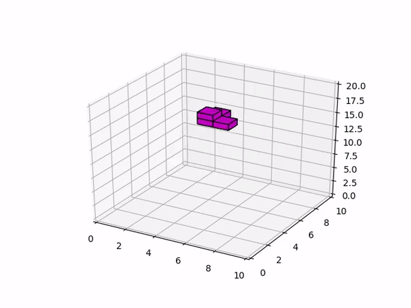

# DeepTetris3d
Reinforcement learning of a 3d tetris agent

## What is DeepTetris3d?
Tetris3d is an implementation of tetris in three dimensions. It functions pretty much the same as conventional 2d tetris,
but up one dimension.(someday I may implement generalized N-dimensional tetris)

Im implemented the game entirely in numpy and rendered it in matplotlib. I think it's akin to building video games in Powerpoint
and Excel, which is hillarious to me.

DeepTetris3d is my ongoing attempts to solving Tetris3d with deep q learning. The game is actually pretty difficult to solve
because the natural reward function (score for clearing a line) is very sparse under random action. In 100,000 trials with random
actions, not a single line was cleared, so the reward function is very hard to optimize early in the learning process.

I settled on a reward function that is a weighted sum of the board height, packing efficiency, variance of column heights along with a small reward
for each game tick and steep penalty for game overs.

The model I used is a custom convolutional network. Since I have access to the board as an array during training time, I sort of saw
this as a computer vision project with 3D images. The network thus borrows from what I've seen in the literature and has Dense blocks and
residual blocks.

The following is my best model (so far).

This project is getting a ground up rewrite! I'm currently working on a library to let me tackle all sorts of games, not just
Tetris3dCheck it out here: [OLEG](https://github.com/PSZehnder/OLEG)

## Requirements
Pytorch (I developed in 1.0, but other versions should work too)
Numpy
